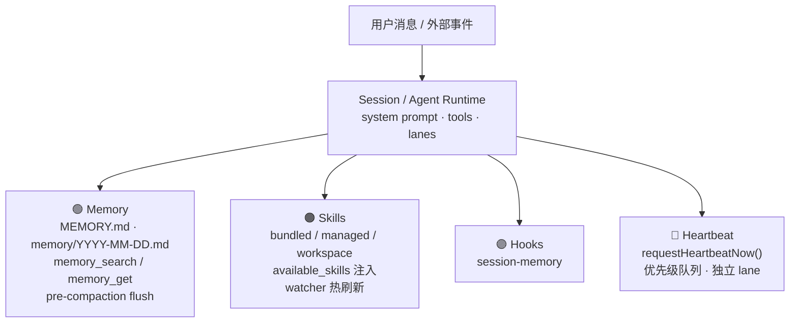
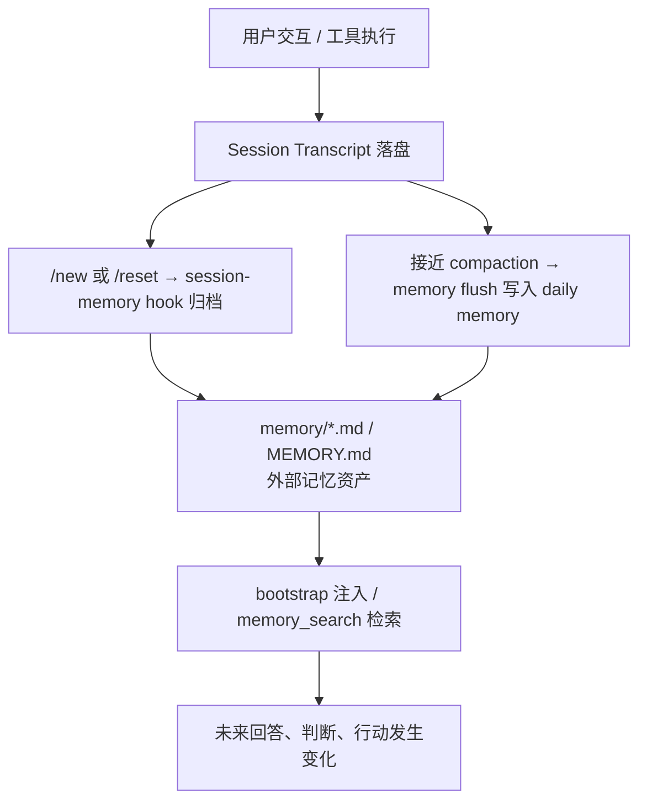
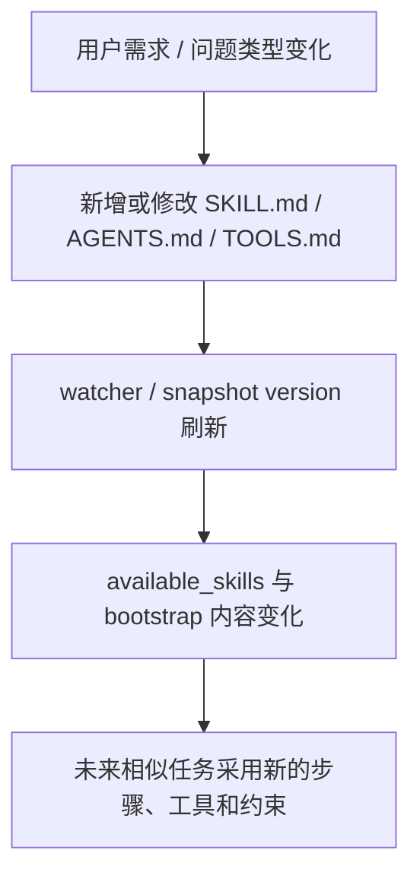
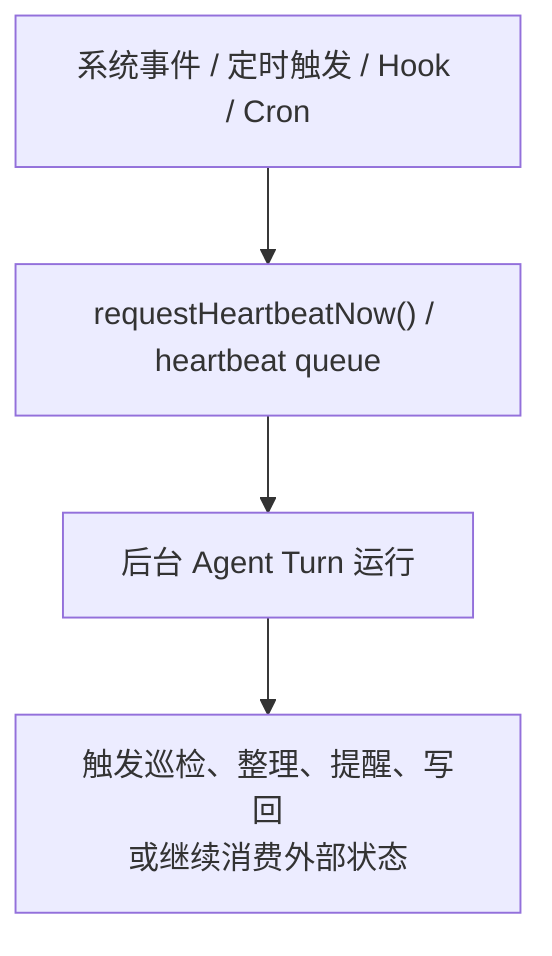

## TL;DR

OpenClaw 的"自进化"不是模型权重更新，也不是在线微调。它的核心，是把经验、规则、技能和调度状态外置到工作区文件、技能目录、会话摘要、Hook 与 Heartbeat 队列中，并在后续运行时重新注入或检索使用。

如果用工程语言概括，这是一套可审计、可热更新、可受控的 **inference-time evolution** 机制。它已经实现了长期记忆、自动沉淀、技能热刷新和主动调度，但没有发现统一的自动评估器、收益验证器或参数级回滚系统。

---

## 为什么这件事值得研究

"Agent 能不能自进化"这个问题，经常被混成两个完全不同的问题：

1. 模型会不会自己训练自己、改自己的参数。
2. 系统会不会在运行中持续积累经验，并让后续行为发生变化。

对 OpenClaw 来说，第一个问题的答案基本是否定的，第二个问题的答案则是肯定的，而且已经有相当完整的工程实现。

很多系统会把"自进化"说成一个抽象口号，但 OpenClaw 更像是把"进化"拆成几个可落地、可观测、可约束的子系统，然后让它们在运行期协同工作。

---

## 先给结论：自进化发生在外部状态，而不是模型参数

如果把自进化定义为"模型权重持续更新"，那么 OpenClaw 不属于这类系统。

如果把自进化定义为"系统在运行过程中持续积累经验、更新规则、扩展行为模板，并在后续任务中复用这些结果"，那么 OpenClaw 已经实现了比较完整的运行时方案。

它的核心闭环可以压缩成一句话：


从源码和文档看，这个闭环主要由四个子系统构成：

1. **记忆系统**：负责"存什么"和"怎么回忆"。
2. **自动沉淀机制**：负责"什么时候把经验写回去"。
3. **技能系统**：负责"能做什么"和"如何做"。
4. **Heartbeat 调度**：负责"什么时候主动运行"。

---

## 总体架构

把与"自进化"最相关的部分抽出来，结构大致如下：



这几层不是互相独立的功能点，而是一个闭环系统：

- Memory 决定什么能沉淀为长期资产。
- Skills 决定未来做事方式如何变化。
- Hooks 把一次会话转成后续可检索的内容。
- Heartbeat 让这些能力不再只能被动等待用户触发。

---

## 一、记忆系统：自进化的知识层

### 记忆的事实源不是数据库，而是工作区 Markdown

OpenClaw 的记忆是 agent workspace 里的 plain Markdown，文件才是 source of truth。

默认有两层：

- `MEMORY.md` — 面向长期、整理过的常青记忆。
- `memory/YYYY-MM-DD.md` — 面向日常追加式的时序日志。

这意味着长期演化不依赖模型"脑内记住了什么"，而依赖外部持久化文件。这个设计带来三个工程特征：

- **可审计**：记忆是文件，不是黑箱权重变化。
- **可回滚**：写坏了可以人工修正。
- **可迁移**：更换模型不等于丢记忆。

### 记忆进入后续推理的两条路径

OpenClaw 不是把所有 memory 都粗暴塞进上下文，而是区分为两条回注路径。

**路径 A：Bootstrap 注入**

`MEMORY.md` 会和 `AGENTS.md`、`SOUL.md`、`TOOLS.md`、`USER.md` 等 bootstrap 文件一起，被注入到 system prompt 的 Project Context 中。注意：`memory/*.md` 日志文件不会自动注入。

**路径 B：按需检索**

默认 memory 插件 `memory-core` 会注册 `memory_search` 和 `memory_get` 两个工具。更关键的是，system prompt 里直接把"先回忆再回答"的策略编码进去了——只要问题涉及 prior work、decision、date、people、preference、todo 这类内容，模型就应该先调用 `memory_search`。

这和"记忆工具存在"是两回事。前者只是提供能力，后者才是真正把"回忆"变成默认行为协议。

### 检索层是抽象的，不绑定单一存储

memory manager 至少支持以下能力路径：

- Markdown 文件作为源数据
- SQLite / FTS / 向量索引
- 可选的 QMD 后端
- 可选的 session transcript indexing

不管底层索引怎么切换，对模型暴露的接口都是 `memory_search` / `memory_get`。上层行为协议稳定，底层检索实现可演进。

### 时间衰减：支持但默认不开启

```ts
export const DEFAULT_TEMPORAL_DECAY_CONFIG = {
  enabled: false,
  halfLifeDays: 30,
};
```

更值得注意的是语义划分：

- `memory/YYYY-MM-DD.md` 这类按日期命名的文件，可参与时间衰减。
- `MEMORY.md` 以及未按日期命名的 evergreen 文件，不参与衰减。
- 无法从路径推断日期时，可以回退到文件 `mtime`。

OpenClaw 不是无差别堆积历史，而是对"长期知识"和"短期事件"做了不同对待。

---

## 二、自动沉淀：经验如何被写回系统

只会"回忆"而不会"沉淀"，不算真正的运行时自进化。OpenClaw 目前已经实现了两条自动写回路径。

### Pre-compaction memory flush

当 session 接近 auto-compaction 时，OpenClaw 会先触发一个静默的 agentic turn，把值得保留的内容写入 memory。

大致流程是：

1. `runMemoryFlushIfNeeded()` 判断当前 token 使用是否接近阈值。
2. 如果满足条件，启动一次隐藏运行（带 `trigger: "memory"`）。
3. 系统给它指定唯一允许写入的目标路径，默认是当天的 `memory/YYYY-MM-DD.md`。
4. 工具层把 `write` 包成 append-only 的受限写入。

这说明三件事：OpenClaw 不是只能读记忆，它已经能主动写记忆；这种写回不是任意改写文件，而是严格受限；默认写入落点是 daily memory，不是自动重写 `MEMORY.md`。

`memory-flush.ts` 里还把安全提示写成了强约束：

- durable memory 只允许存到 `memory/YYYY-MM-DD.md`
- 已有文件只能 append，不能覆盖
- `MEMORY.md`、`SOUL.md`、`TOOLS.md`、`AGENTS.md` 等 bootstrap/reference 文件在 flush 期间视为只读

这些约束决定了 OpenClaw 的"进化"不会演变成"随意自改核心身份文件"。

### Session-memory hook：会话归档器

除了 pre-compaction flush，还有 `session-memory` hook。当 `/new` 或 `/reset` 时触发：

- 监听 command 事件
- 读取当前或前一个 session transcript
- 生成一个描述性 slug
- 把内容输出到 `<workspace>/memory/YYYY-MM-DD-<slug>.md`

它不是把整个 transcript 当作未来都要检索的原始材料，而是先把一段会话转成更适合后续消费的记忆文档。

和 memory flush 的职责区分：

- **memory flush** 解决"上下文快压缩了，先保住内容"。
- **session-memory hook** 解决"这个会话结束了，归档一份摘要"。

### 边界也非常清楚

当前 OpenClaw 的自动写回能力，已经做到了：会触发、会落盘、会写到可检索位置、会受到写入限制和只读保护。

但它还没有自动完成这些：自动去重 daily memory、自动把短期日志整理成高质量长期知识库、自动把 `MEMORY.md` 维护成结构化的 evergreen memory。

换句话说，它已经实现了"先把经验保下来"，但没有完全实现"自动把经验整理成成熟知识库"。

---

## 三、会话日志：基础资产，不是默认记忆层

OpenClaw 会把 transcript 落盘到：

```text
~/.openclaw/agents/<agentId>/sessions/*.jsonl
```

但必须区分两件事：

1. transcript 会被持久化 — **成立**。
2. transcript 会默认进入 `memory_search` — **不是默认成立**。

文档已经把 `sessions` 明确定义为可选 source。session transcript 是潜在的知识源，但不是默认每次都会进入长期记忆召回。

---

## 四、技能系统：行为层的自进化

如果说 memory 负责"积累经验"，那么 skills 负责"改变做事方式"。

### 技能不是附属功能，而是行为模板系统

OpenClaw 的 skills 本质上是 AgentSkills-compatible 的 skill 目录，每个 skill 以 `SKILL.md` 为核心。和"写进 daily memory 一条经验"相比，skill 的影响更大，因为它改的是行为模板：

- 何时使用某类工具
- 处理某类问题的步骤顺序
- 使用外部系统时的注意事项
- 某种任务的标准工作流

从自进化视角看：memory 更像知识层，skill 更像策略层或能力层。

### 清晰的覆盖链

技能加载的实际优先级：

```text
extra
< bundled
< managed (~/.openclaw/skills)
< ~/.agents/skills
< <workspace>/.agents/skills
< <workspace>/skills
```

同名 skill 会被后加载者覆盖。这天然支持官方基线技能、本机共享技能、项目级技能、工作区内强覆盖——一套成熟的"行为层演化通道"。

### 摘要注入 + 延迟读取

system prompt 不会把所有技能全文塞进去，而是只注入一个 `<available_skills>` 摘要列表。然后 prompt 明确要求模型：先扫描技能描述，只在确定技能匹配时再读取 `SKILL.md`，不要一上来就读多个 skill。

好处：节省 token、降低无关技能污染上下文、保持技能热更新后的生效成本足够低。

### 技能热刷新是实装能力

OpenClaw 使用 `chokidar` 监听 skill 变化：

- 默认 watch 开启，debounce 为 250ms
- 监听 `add`、`change`、`unlink`
- 变化后 bump snapshot version
- 下一次 agent turn 自动用新的 skills snapshot

这不是依赖 heartbeat 轮询生效，而是文件变化后直接刷新快照版本。技能系统真正具备了热更新特征。

---

## 五、Heartbeat：不是知识本体，而是激活层

### 解决"Agent 什么时候自己醒来"

没有 Heartbeat 时，Agent 只能被动等待用户输入。有了 Heartbeat 后，系统可以在后台被主动唤醒：巡检、跟进、定期检查外部状态、批量消费系统事件、和 Cron/Hook 配合做长期运行。

Heartbeat 不是"学习算法"，但它是让系统具备持续行为变化能力的必要条件之一。

### 队列和优先级是真实存在的

```ts
const DEFAULT_COALESCE_MS = 250;
const DEFAULT_RETRY_MS = 1_000;
const REASON_PRIORITY = {
  RETRY: 0,
  INTERVAL: 1,
  DEFAULT: 2,
  ACTION: 3,
};
```

Heartbeat 不是简单定时器，而是带调度策略的唤醒层：

- 250ms 合并窗口减少抖动
- 高优先级原因可以覆盖低优先级原因
- 主 lane 忙时延迟重试
- 可按 agent / session 维度拆分唤醒目标

---

## 六、拼起来看：三个闭环

### 知识闭环



### 行为闭环



### 调度闭环



单看每个模块都不新鲜。但连起来看，OpenClaw 已经具备了一个相当成熟的运行时演化系统雏形：它能积累、能回忆、能热更新、能主动运行、还能在一定边界内自写回。

---

## 七、为什么这已经可以称为"自进化"

很多人一看到"没有改模型参数"，就会本能地觉得这不算自进化。我不完全同意。

从工程系统视角出发，一个 Agent 是否"进化"，关键不在于它有没有改权重，而在于：

- 它的后续行为有没有持续变化。
- 这种变化是不是由运行期积累的外部状态驱动。
- 这种变化能不能被后续任务持续复用。

按照这个标准，OpenClaw 的答案是明确的：

- 会话可以沉淀成记忆。
- 记忆会影响后续回答。
- 技能可以热刷新并改变后续工作流。
- Hook 和 Heartbeat 可以在无人显式提问时继续推进系统状态。

更准确的判断不是"它会不会自己训练自己"，而是：**它已经实现了 context-layer self-evolution。**

---

## 八、同样重要的另一面：它还没有做到什么

这部分比"能力清单"更重要，因为技术博客最容易在这里失真。

### 没有参数级在线学习

当前仓库里没有发现以下运行路径的证据：模型微调、LoRA / Adapter 训练、在线强化学习、基于 reward 的自动优化、自动选择更优参数版本并回滚。它不是参数演化系统。

### 自动沉淀不等于自动知识整理

当前自动沉淀主要落在 `memory/YYYY-MM-DD.md` 和 `memory/YYYY-MM-DD-<slug>.md`。这更像"日志化经验资产"，而不是"自动维护的结构化知识库"。

### Session recall 是可选项，不是默认事实

session transcript 落盘是默认事实，但 transcript 默认进入 `memory_search` 不是。这是一个必须保持严谨的边界。

### 没有统一的收益验证与回滚闭环

没有发现一个统一控制器会自动完成：读取运行轨迹和反馈 → 自动决定修改哪类 memory / skill / rule → 验证修改后是否带来收益 → 收益不稳定时自动回滚。

OpenClaw 已经是一个很强的"自进化 substrate"，但还不是一个完整内建的"反馈驱动自优化控制器"。

---

## 最终判断

> OpenClaw 并没有实现模型参数层的自进化，但它已经实现了一套工程化的上下文层自进化机制：通过文件化记忆、受限写回、技能热刷新和主动调度，让系统在部署后持续积累经验并改变后续行为。

- 优势：可控、可审计、可热更新。
- 边界：所有进化都发生在外部状态上，而不是模型权重中。
- 下一步潜力：不在"把日志记得更多"，而在"把反馈评估和变更验证闭环补齐"。

---

## 结语

OpenClaw 最值得借鉴的地方，不是它宣称自己能"自进化"，而是它把这件事拆成了一组工程上可落地的机制：

- 记忆不是黑箱，而是文件。
- 写回不是任意修改，而是受限策略。
- 技能不是一次性 prompt，而是可覆盖、可热刷新的行为模板。
- Heartbeat 不是装饰性的定时器，而是主动运行的调度层。

这套设计非常现实，也非常克制。它没有试图用一句"Agent 会自己变强"掩盖复杂性，而是把"系统如何逐步改变自己"拆成了可读、可查、可控的几个组件。对真正关心 Agent 工程落地的人来说，这比任何抽象口号都更有价值。

---

## 参考材料

- `openclaw/src/agents/system-prompt.ts` — system prompt 构建与 bootstrap 注入
- `openclaw/extensions/memory-core/index.ts` — memory_search / memory_get 工具注册
- `openclaw/src/memory/temporal-decay.ts` — 时间衰减配置与语义
- `openclaw/src/auto-reply/reply/memory-flush.ts` — pre-compaction memory flush
- `openclaw/src/auto-reply/reply/agent-runner-memory.ts` — memory flush 运行器
- `openclaw/src/hooks/bundled/session-memory/handler.ts` — session-memory hook
- `openclaw/src/agents/skills/workspace.ts` — 技能加载与覆盖链
- `openclaw/src/agents/skills/refresh.ts` — 技能热刷新（chokidar watcher）
- `openclaw/src/infra/heartbeat-wake.ts` — heartbeat 唤醒队列与优先级
- `openclaw/src/infra/heartbeat-runner.ts` — heartbeat 运行器
- `openclaw/docs/concepts/memory.md` — 记忆系统概念文档
- `openclaw/docs/concepts/system-prompt.md` — system prompt 概念文档
- `openclaw/docs/tools/skills.md` — 技能系统文档
- `openclaw/docs/automation/hooks.md` — Hook 自动化文档
